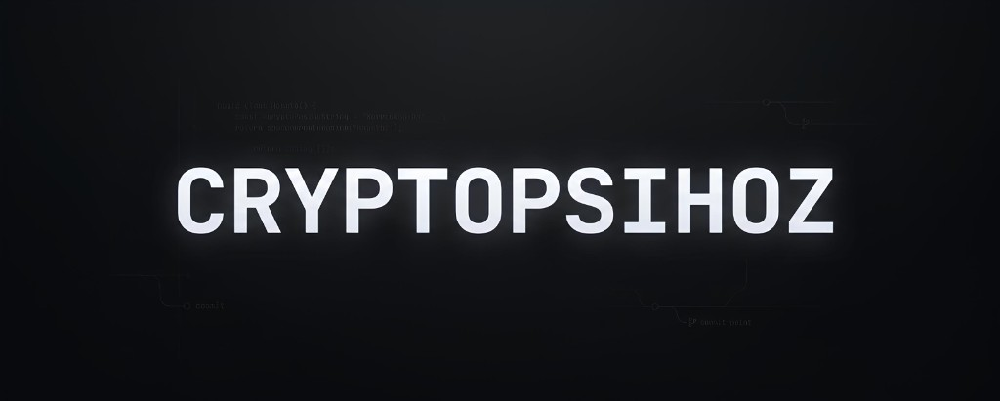

<!--
  GitHub profile README for rimtoln (cryptopsihoz)
-->

  

<table>
<tr>
<td valign="top" width="58%">

### 👋 Hi, everyone!

**cryptopsihoz** - Solana desks for the pump.fun tape.

Agent swarms that scout, filter, and size. Tools that keep memory on the **deployer**, not the ticker that dies tomorrow. Paper-first builds: one job per agent, rules you set, latency the desk eats.

### 🌟 What I ship

- **FOMOFUN** - hunt newborn clones after the dev  
- **MEMFUN** - deployer memory + DOSE sizing  
- **COPUMP** - vote before the fill  
- **FLETCH** - Robinhood Chain hunt  

### ⚙️ Stack I ship with

  
  
  
  
  
   
  
  
  
  
  
   
  
  
  
  

### ✉️ Contact

  
  &nbsp;
  
  &nbsp;
  
  &nbsp;
  

</td>
<td valign="top" width="42%" align="center">

</td>
</tr>
</table>

### 📊 X analytics · [@rimtoln](https://x.com/rimtoln)

Live follower count + desk snapshot for the cryptopsihoz tape on X.

  
  &nbsp;
  
  &nbsp;
  

| | |
| :--- | ---: |
| **X handle** | [@rimtoln](https://x.com/rimtoln) |
| **display name** | cryptopsihoz |
| **followers** | **14.9k** |
| **following** | 4.6k |
| **posts** | 164k |
| **likes given** | 243k |
| **joined** | Feb 2022 |
| **site** | [cryptopsihoz.com](https://cryptopsihoz.com) |
| **fomo link** | [fomo.family/r/rimtoln](https://fomo.family/r/rimtoln) |

Table numbers are a desk snapshot (Sep 2026). Badges above refresh live.

---

  pump.fun is the board - cryptopsihoz built the desk

