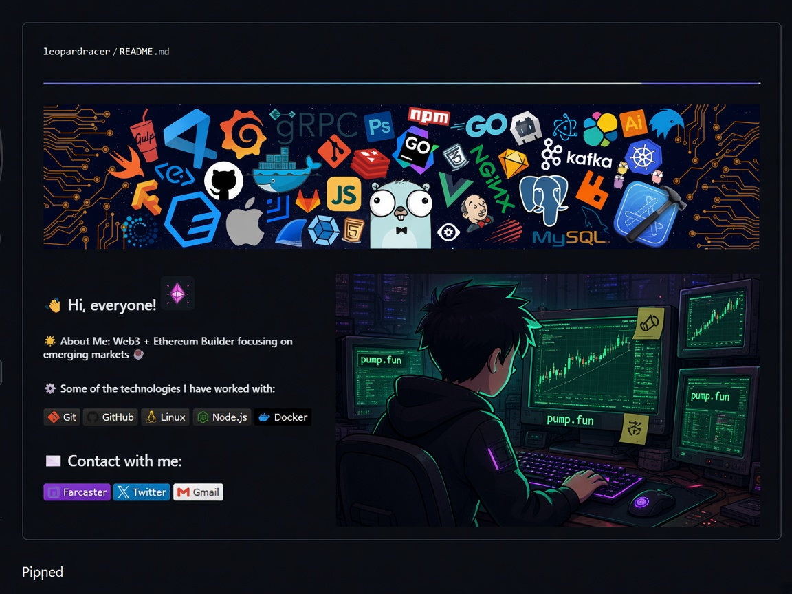

<!--
  GitHub profile README for rimtoln (cryptopsihoz)
  Repo must be named: rimtoln/rimtoln (public)
-->

  

<table>
<tr>
<td valign="top" width="56%">

### 👋 Hi, everyone!

**cryptopsihoz** — Solana / pump.fun desks, agent swarms, tools that remember the deployer.

### 🌟 About Me

Builder of trading desks and memory tools for the pump.fun tape.  
Paper-first. One job per agent. Thesis on the wallet, not the ticker.

- FOMOFUN — hunt newborn clones after the dev  
- MEMFUN — deployer memory + DOSE sizing  
- COPUMP — vote before the fill  
- FLETCH — Robinhood Chain hunt  

### ⚙️ Stack I ship with

  
  
  
  
  

### ✉️ Contact

  
  
  

</td>
<td valign="top" width="44%" align="center">

</td>
</tr>
</table>

---

  pump.fun is the board · cryptopsihoz built the desk

